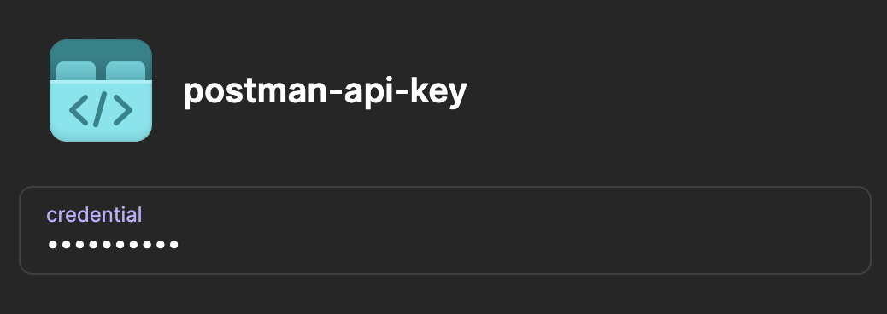
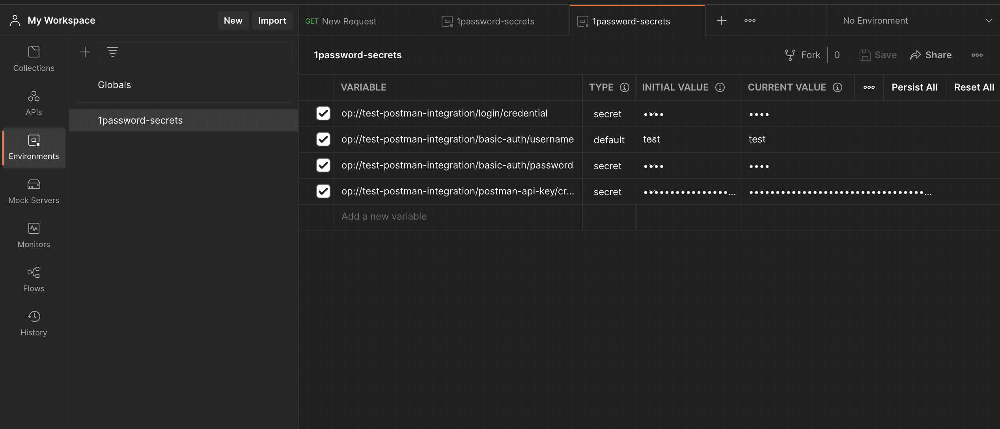

# Table of Contents
[Description](#description)\
[Key Features](#key-features)\
[Getting Started](#getting-started)\
&nbsp;&nbsp;&nbsp;&nbsp;[Prerequisites](#prerequisites)\
&nbsp;&nbsp;&nbsp;&nbsp;[Installation](#installation)\
[Commands](#commands)\
&nbsp;&nbsp;&nbsp;&nbsp;[run-collection](#run-collection)\
&nbsp;&nbsp;&nbsp;&nbsp;[inject-secrets](#inject-secrets)

# Description
TODO: Copy description from 301 Repo
# Key Features
There are the following commands which can be used:\
`run-collection`\
TODO: Description of command goes here\
`inject-secrets`\
TODO: Description of command goes here
# Getting Started
## Prerequisites

- [1Password CLI](https://developer.1password.com/docs/cli/get-started)
- [Node.js and npm](https://docs.npmjs.com/downloading-and-installing-node-js-and-npm)

## Installation

- Clone the repository
- Run `npm install`

# Commands
## `run-collection`
Run a Postman collection with specified 1Password secret.

### Flags
TODO: Table
## `inject-secrets`

Command to inject 1Password secrets into a your Postman account (as variables in a Postman environment).

### Required Setup

To use this command, an integration with Postman API will be required. Please follow steps below:

- [Generate a Postman API Key](https://learning.postman.com/docs/developer/intro-api/#generating-a-postman-api-key)
- Copy your Postman API Key and place it into your 1Password vault (in the credential field of an API Key item), for example:

 \

**Optional Step**:
- For convenience, place the 1Password reference path to the Postman API Key in an environment variable named `POSTMAN_API_KEY_PATH`:

```
export POSTMAN_API_KEY_PATH=op://VAULT/ITEM-NAME
```

### Usage

Use the command as following: 

```
npm run inject-secrets -s op://<VAULT-NAME>/<POSTMAN-API-KEY-PATH> -e <POSTMAN-ENV-NAME> -r
```

#### Example
- Run the command 
  - *Note*: You can omit the `-s op://<VAULT-NAME>/<POSTMAN-API-KEY-PATH>` flag if you have completed the Optional Step in the Setup above
  - 1Password CLI will require authentication to access the secrets

```
> npm run inject-secrets -s op://test-postman-integration/postman-api-key -e 1password-secrets

? Please select the secrets you want to inject into Postman

 (Press <space> to select, <a> to toggle all, <i> to invert selection, and <enter> to proceed)
 ──────────────
❯◯ 🎉 Welcome to 1Password!           |                      Personal
 ◯ 1Password Account                  |                      Personal
 ◯ login                              |      test-postman-integration
 ◯ basic-auth                         |      test-postman-integration
 ◯ postman-api-key                    |      test-postman-integration
(Move up and down to reveal more choices)
```

- Follow the directions to select the secrets you want to inject into your Postman account
  - In this example, the secrets `login`, `basic-auth`, and `postman-api-key` were selected to be injected into Postman
- After the command finishes executing, the secrets will able available for you to use in your Postman account under an environment named `1password-secrets`
  - *Note*: The name of the secrets correspond to the 1Password reference path of the secret fields



### Flags

Option | Description | Optional | Default | Example
--- | --- | --- | --- | ---
`-s <POSTMAN-API-KEY-PATH>` | The path in 1Password to your Postman API Credential. | Yes | If this flag is not used, the value in `POSTMAN_API_KEY_PATH` environment variable will be used by default. | `-s op://VAULT/ITEM-NAME` 
`-e <POSTMAN-ENV-NAME>` | The name of the Postman environment to inject secrets into. | Yes | `1password-secrets` | `-e secrets-from-1password` 
`-r` | Replace the entire Postman environment such that it only contains selected secrets. | Yes | By default this flag is not applied and selected secrets are merged into the environment with existing secrets. | `-r` 


# License

[](https://opensource.org/licenses/MIT)