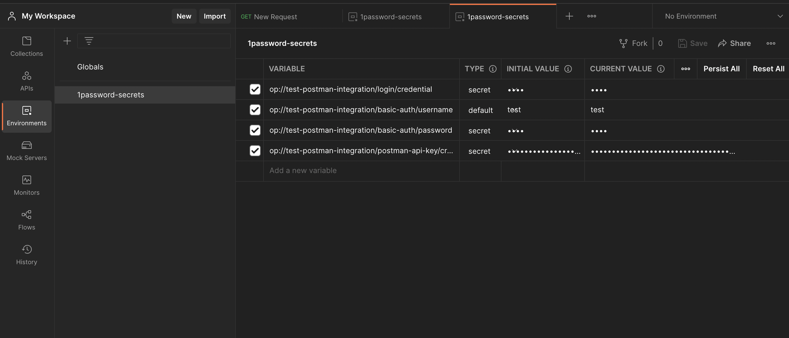

# 1Password Postman Integration
This project is a [Postman](https://learning.postman.com/docs/getting-started/introduction/) integration with the [1Password CLI](https://developer.1password.com/docs/cli/) that allows users to load API Keys and other secrets stored in 1Password into Postman.

# Table of Contents
[Description](#description)\
[Getting Started](#getting-started)\
&nbsp;&nbsp;&nbsp;&nbsp;[Prerequisites](#prerequisites)\
&nbsp;&nbsp;&nbsp;&nbsp;[Installation](#installation)\
[Commands](#commands)\
&nbsp;&nbsp;&nbsp;&nbsp;[run-collection](#run-collection)\
&nbsp;&nbsp;&nbsp;&nbsp;[inject-secrets](#inject-secrets)\
&nbsp;&nbsp;&nbsp;&nbsp;[sync-secrets](#sync-secrets)

# Description
More than 20 million users use Postman to make HTTP requests and virtually every request requires passing an API key to authenticate, bringing complexity to developer workflows. Typically, developers have to manually copy tokens, which leads to improper management of secrets and ultimately security risks. Instead, users can store these tokens in 1Password and use this 1Password Postman Integration with the 1Password CLI to fetch the secrets securely and make API calls using Postman without exposing or copying/pasting the secrets.
# Getting Started
## Prerequisites
- Having a [1Password Account](https://1password.com)
- Having [1Password CLI](https://developer.1password.com/docs/cli/get-started) installed
- Having [Node.js and npm](https://docs.npmjs.com/downloading-and-installing-node-js-and-npm) installed
- Having [Postman](https://www.postman.com)

## Installation

- Clone the repository
- Run `npm install`

# Commands
## `run-collection`
Run a Postman collection with specified 1Password secret.

### Required Setup
To use this command, a Postman collection JSON is required. Please follow the steps below:
- [Export a Postman Collection](https://learning.postman.com/docs/getting-started/importing-and-exporting-data/#exporting-collections)
 

- Create an API Credential item in your 1Password vault with the authorization credentials to the request. \
(**Note: You need to customize field name in the Credential to match with the [YAML file](app/authType.yml)**)
 

### Usage
Use the command as follows:
```
node ./app/commander run-collection op://<VAULT-NAME>/<REQUEST-AUTH-DETAILS-ITEM> <PATH-TO-COLLECTION-JSON> --type <AUTH-TYPE>
```
The following authorization types are currently supported:
- No Auth (`noauth`)
- Basic Auth (`basic`)
- Bearer Token (`token`)
- API Key (`apikey`)
- Digest Auth (`digest`)
- OAuth 1.0 (`oauth1`)
- Hawk Authentication (`hawk`)
- AWS Signature (`awsv4`)
- NTLM Authentication [Beta] (`ntlm`)
- Akamai EdgeGrid (`edgegrid`)

For information on the fields of each authorization type, please see the [YAML file](app/authType.yml).\
For more information on the authorization types, please check the [Postman documentation](https://learning.postman.com/docs/sending-requests/authorization/).

#### Example
- Run the command with:
  - [Secret reference](https://developer.1password.com/docs/cli/secrets-reference-syntax/) to a 1Password item storing the authorization details (e.g. `op://Personal/Basic-Auth`)
  - Path to the collection JSON (e.g. `./postman-collection-basic`)
  - Authorization type (e.g. `basic`)
- 1Password CLI will require authentication to access the secrets
- Request should be run without having to copy and paste any of the required secrets.

### Flags
| Option           | Description                                            | Optional | Default  | Example       |
|------------------|--------------------------------------------------------|----------|----------|---------------|
| `-s <AUTH-TYPE>` | The type of the authorization for the Postman request. | Yes      | `noauth` | `-type basic` |

## `inject-secrets`

Inject 1Password secrets into your Postman account (as variables in a Postman environment).

### Required Setup

To use this command, an integration with Postman API will be required. Please follow steps below:

- [Generate a Postman API Key](https://learning.postman.com/docs/developer/intro-api/#generating-a-postman-api-key)
- Copy your Postman API Key and place it into your 1Password vault (in the credential field of an API Key item), for example:

 \

**Optional Step**:
- For convenience, place the 1Password reference path to the Postman API Key in an environment variable named `POSTMAN_API_KEY_PATH`:

```
export POSTMAN_API_KEY_PATH=op://VAULT/ITEM-NAME
```

### Usage

Use the command as follows: 

```
node ./app/commander.js inject-secrets -s op://<VAULT-NAME>/<POSTMAN-API-KEY-PATH> -e <POSTMAN-ENV-NAME> -r
```

**Postman Tip**: You can only use the variable in your requests if the environment the variable is in is set to `Active`. You may want to run this command on an already active environment that you are using, to do so, provide the name of the environment with the `-e` flag and avoid using the `-r` flag since you will lose all pre-existing variables in that environment. More details about the flags are below.

#### Example
- Run the command 
  - *Note*: You can omit the `-s op://<VAULT-NAME>/<POSTMAN-API-KEY-PATH>` flag if you have completed the Optional Step in the Setup above
  - 1Password CLI will require authentication to access the secrets

```
> node ./app/commander.js inject-secrets -s op://test-postman-integration/postman-api-key -e 1password-secrets

? Please select the secrets you want to inject into Postman

 (Press <space> to select, <a> to toggle all, <i> to invert selection, and <enter> to proceed)
 ──────────────
❯◯ 🎉 Welcome to 1Password!           |                      Personal
 ◯ 1Password Account                  |                      Personal
 ◯ login                              |      test-postman-integration
 ◯ basic-auth                         |      test-postman-integration
 ◯ postman-api-key                    |      test-postman-integration
(Move up and down to reveal more choices)
```

- Follow the directions to select the secrets you want to inject into your Postman account
  - In this example, the secrets `login`, `basic-auth`, and `postman-api-key` were selected to be injected into Postman
- After the command finishes executing, the secrets will be available for you to use in your Postman account under an environment named `1password-secrets`
  - *Note*: The name of the secrets correspond to the 1Password reference path of the secret fields



### Flags

| Option                      | Description                                                                         | Optional | Default                                                                                                         | Example                     |
|-----------------------------|-------------------------------------------------------------------------------------|----------|-----------------------------------------------------------------------------------------------------------------|-----------------------------|
| `-s <POSTMAN-API-KEY-PATH>` | The path in 1Password to your Postman API Credential.                               | Yes      | If this flag is not used, the value in `POSTMAN_API_KEY_PATH` environment variable will be used by default.     | `-s op://VAULT/ITEM-NAME`   |
| `-e <POSTMAN-ENV-NAME>`     | The name of the Postman environment to inject secrets into.                         | Yes      | `1password-secrets`                                                                                             | `-e secrets-from-1password` |
| `-r`                        | Replace the entire Postman environment such that it only contains selected secrets. | Yes      | By default this flag is not applied and selected secrets are merged into the environment with existing secrets. | `-r`                        |

## `sync-secrets`

Synchronize previously injected 1Password secrets in a Postman Environment. This command updates your postman environment to contain the latest version of your secrets stored in 1Password.

### Required Setup

Same setup as `inject-secrets` command.

### Usage

Use the command as follows: 

```
node ./app/commander.js sync-secrets -s op://<VAULT-NAME>/<POSTMAN-API-KEY-PATH> -e <POSTMAN-ENV-NAME>
```

**Postman Note**: Postman stores 2 versions of each variable in the environment, an `Initial Value` and a `Current Value`. This command only updates the `Initial Value` version of the variable, and it is the `Current Value` version that referencing the variable will replace. To set the `Current Value` to be the `Initial Value` after running this command, simply select the `Reset All` option (to update `Current Value` of all variables, including ones not updated by running this command) or select `Reset` from the 3-dot menu of the individual variables (to update `Current Value` of only that variable). 

#### Example
- Run the command 
  - *Note*: You can omit the `-s op://<VAULT-NAME>/<POSTMAN-API-KEY-PATH>` flag if you have completed the Optional Step in the Setup
  - 1Password CLI will require authentication to access the secrets

```
> node ./app/commander.js sync-secrets -s op://test-postman-integration/postman-api-key -e 1password-secrets
```

- After the command finishes executing, the secrets will be updated in your Postman account under an environment named `1password-secrets`
  - *Note*: Only the name of the variables that correspond to the 1Password reference path of the secret fields will be updated with the latest value. All other variables will be left untouched.


### Flags

| Option                      | Description                                                                    | Optional | Default                                                                                                     | Example                     |
|-----------------------------|--------------------------------------------------------------------------------|----------|-------------------------------------------------------------------------------------------------------------|-----------------------------|
| `-s <POSTMAN-API-KEY-PATH>` | The path in 1Password to your Postman API Credential.                          | Yes      | If this flag is not used, the value in `POSTMAN_API_KEY_PATH` environment variable will be used by default. | `-s op://VAULT/ITEM-NAME`   |
| `-e <POSTMAN-ENV-NAME>`     | The name of the Postman environment to contain the previously injected secrets | Yes      | `1password-secrets`                                                                                         | `-e secrets-from-1password` |


# License

[](license)
